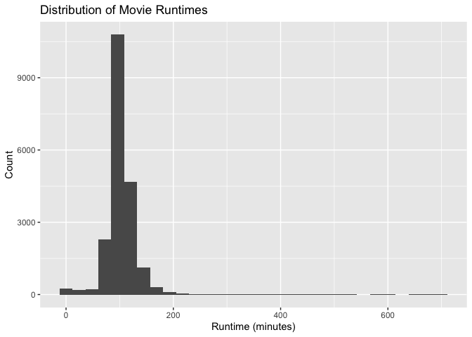
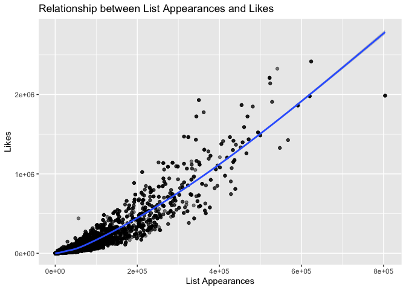
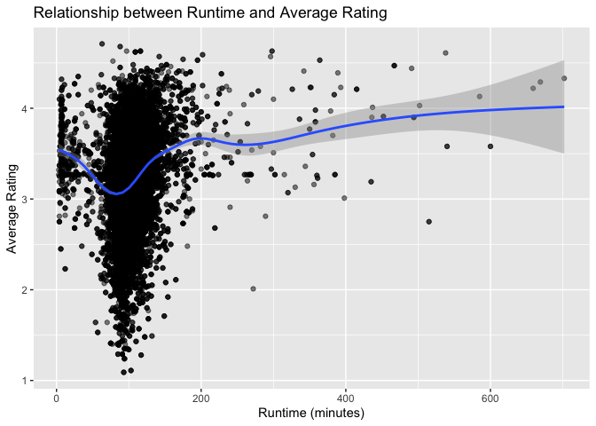

Data Cleaning
================
2025-11-24

``` r
library(tidyverse)
```

    ## ── Attaching core tidyverse packages ──────────────────────── tidyverse 2.0.0 ──
    ## ✔ dplyr     1.1.4     ✔ readr     2.1.5
    ## ✔ forcats   1.0.0     ✔ stringr   1.5.2
    ## ✔ ggplot2   3.5.2     ✔ tibble    3.3.0
    ## ✔ lubridate 1.9.4     ✔ tidyr     1.3.1
    ## ✔ purrr     1.1.0     
    ## ── Conflicts ────────────────────────────────────────── tidyverse_conflicts() ──
    ## ✖ dplyr::filter() masks stats::filter()
    ## ✖ dplyr::lag()    masks stats::lag()
    ## ℹ Use the conflicted package (<http://conflicted.r-lib.org/>) to force all conflicts to become errors

Improting the Data, filter only English-language films

``` r
movie_df = read.csv("data/letterbox_movie_classification_dataset.csv") |>
  janitor::clean_names() |>
  filter(original_language == "English") |>
  select(film_title, director, average_rating, genres, runtime, original_language, description, studios, watches, list_appearances, likes, fans, lowest, medium, highest, total_ratings) |> 
  mutate(genres = str_remove_all(genres, "\\[|\\]|'")) |>
  separate_rows(genres, sep = ",\\s*") 
```

EDA - genre count

``` r
genre_count = 
  movie_df |>
  group_by(genres) |>
  summarise(film_count = n()) |>
  arrange (desc(film_count))

print (genre_count)
```

    ## # A tibble: 30 × 2
    ##    genres          film_count
    ##    <chr>                <int>
    ##  1 Drama                 3346
    ##  2 Comedy                2620
    ##  3 Thriller              1940
    ##  4 Action                1683
    ##  5 Horror                1458
    ##  6 Crime                 1255
    ##  7 Adventure             1230
    ##  8 Romance               1146
    ##  9 Science Fiction       1070
    ## 10 Fantasy                769
    ## # ℹ 20 more rows

EDA - top 5 films based on watches (mainstream popularity)

``` r
top_films = 
  movie_df |>
  arrange(desc(watches)) |>
  select(film_title, director, watches) |>
  slice_head(n = 5)

print(top_films)
```

    ## # A tibble: 5 × 3
    ##   film_title   director          watches
    ##   <chr>        <chr>               <int>
    ## 1 Barbie       Greta Gerwig      5195503
    ## 2 Barbie       Greta Gerwig      5195503
    ## 3 Fight Club   David Fincher     5059722
    ## 4 Interstellar Christopher Nolan 5044987
    ## 5 Interstellar Christopher Nolan 5044987

EDA - top 5 films based on average rating (critical acclaim)

``` r
top_rated = 
  movie_df |>
  arrange(desc(average_rating)) |>
  select(film_title, director, average_rating) |>
  slice_head(n = 5)

print(top_rated)
```

    ## # A tibble: 5 × 3
    ##   film_title                                 director       average_rating
    ##   <chr>                                      <chr>                   <dbl>
    ## 1 Radiohead: In Rainbows - From the Basement David Barnard            4.71
    ## 2 Radiohead: In Rainbows - From the Basement David Barnard            4.71
    ## 3 Stop Making Sense                          Jonathan Demme           4.68
    ## 4 Stop Making Sense                          Jonathan Demme           4.68
    ## 5 12 Angry Men                               Sidney Lumet             4.63

EDA - distribution of movie runtimes (please edit the aesthetics of it)

``` r
ggplot(movie_df, aes(x = runtime)) +
  geom_histogram () +
  labs (title = "Distribution of Movie Runtimes",
        x = "Runtime (minutes)", y = "Count")
```

    ## `stat_bin()` using `bins = 30`. Pick better value with `binwidth`.

<!-- -->

Is this an EDA? - relationship between list appearances and likes
(please edit the aesthetics of it)

``` r
ggplot(movie_df, aes(x=list_appearances, y = likes)) +
  geom_point (alpha = 0.5) +
  geom_smooth () + 
  labs (title = "Relationship between List Appearances and Likes",
        x = "List Appearances", y = "Likes")
```

    ## `geom_smooth()` using method = 'gam' and formula = 'y ~ s(x, bs = "cs")'

<!-- -->

Is this an EDA? - relationship between runtime and average rating
(please edit the aesthetics of it)

``` r
ggplot(movie_df, aes(x=runtime, y=average_rating)) +
  geom_point(alpha=0.5) +
  geom_smooth() +
  labs (title = "Relationship between Runtime and Average Rating",
        x = "Runtime (minutes)", y = "Average Rating")
```

    ## `geom_smooth()` using method = 'gam' and formula = 'y ~ s(x, bs = "cs")'

<!-- -->

Cont. EDA of relationship between runtime and average rating

``` r
runtime_rate_df =
  movie_df |>
  mutate(runtime_category = case_when(
    runtime <= 90 ~ "Short",
    runtime > 90 & runtime <= 120 ~ "Medium",
    runtime > 120 ~ "Long"
  ))

runtime_rate_df |>
  group_by (runtime_category) |>
  summarise (avg_rating = mean(average_rating, na.rm = TRUE)) |>
  arrange (desc(avg_rating))
```

    ## # A tibble: 3 × 2
    ##   runtime_category avg_rating
    ##   <chr>                 <dbl>
    ## 1 Long                   3.44
    ## 2 Medium                 3.16
    ## 3 Short                  3.10

The next two chunks of code is the same, only nature of run time
variable is different

Linear Regression Model to further analyze the relationship between run
time and average rating (run time as continuous variable)

``` r
runtime_rate_model_cont = lm(average_rating ~ runtime, data = movie_df)
```

Linear Regression Model to further analyze the relationship (run time as
categorical variable )

``` r
runtime_rate_model_cat = lm(average_rating ~runtime_category, data = runtime_rate_df)
```

The next two chunks of code is the same, only nature of run time
variable is different

Linear Regression Model to analyze the relationship between watches and
run time (run time as cont. variable)

``` r
runtime_watch_model_cont = lm(watches ~ runtime, data = movie_df)
```

Linear Regression Model to analyze the relationship between watches and
run time (run time as categorical variable)

``` r
runtime_watch_model_cat = lm(watches ~ runtime_category, data = runtime_rate_df)
```
