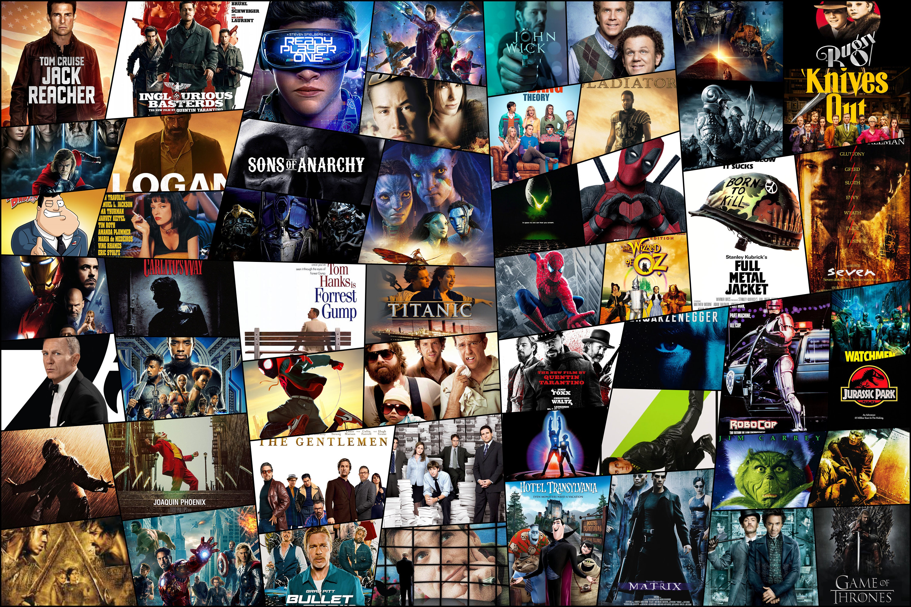

Have you ever watched a highly rated film anticipating the most spectacular cinematic experience of a lifetime, but left feeling disappointed and questioning just what led to such a high rating? Have you ever stayed up late at night pondering: just what is the secret ingredient to a highly rated film. Is it because the film's genre was drama? (The most frequently seen movie genre!) Perhaps because the film was directed by a critically acclaimed director? Or maybe it is just as simple as the film was less than 2 hours long. 

We will attempt to answer those questions using this [Letterbox Movie Classification](https://www.kaggle.com/datasets/sahilislam007/letterbox-movie-classification-dataset) dataset from [Kaggle](https://www.kaggle.com/)! 

## Video Overview
<iframe width="560" height="315" src="https://www.youtube.com/embed/fvhCAbR0Atw?si=B0dxorrsN8FFE_Ml" title="YouTube video player" frameborder="0" allow="accelerometer; autoplay; clipboard-write; encrypted-media; gyroscope; picture-in-picture; web-share" referrerpolicy="strict-origin-when-cross-origin" allowfullscreen></iframe>

## Site Features

You will find our [data cleaning](Data-Cleaning.html) process, some of our [exploratory data analysis](eda.html), as well as all our analysis! 

Our [regression analyses](regression.html) page will give you some insight on variables that we hypothesized will impact a film's average rating, and our [model building](mode.html) page will give you an inside look at our attempt (key word here is attempt) to crack the 
*perfect* secret recipe for higher film ratings. 
